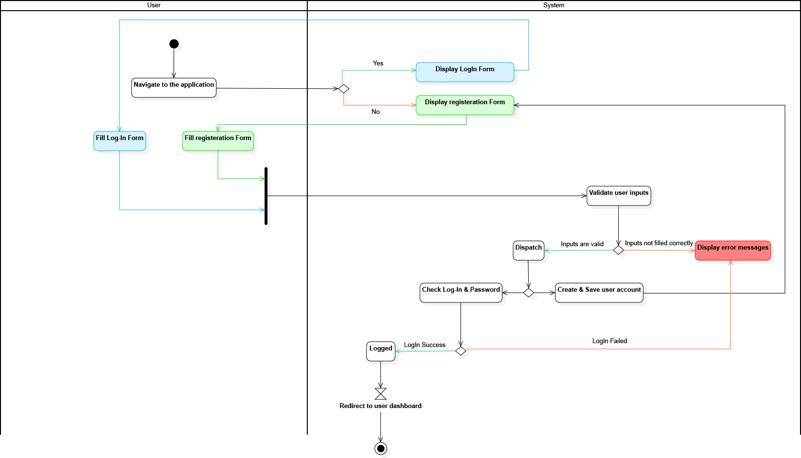

## Diagramme d'activité : Inscription & Connexion

[< Retour à l'accueil](README.md)

Le diagramme d'activité montre visuellement les étapes et actions séquentielles dans un système, illustrant comment les utilisateurs interagissent avec le système et comment celui-ci répond. Chaque diagramme représente un scénario spécifique, montrant le flux logique des actions, les décisions prises et les branches conditionnelles possibles. Il est essentiel pour analyser et optimiser les processus, comprendre les interactions complexes et améliorer l'efficacité globale des opérations.

