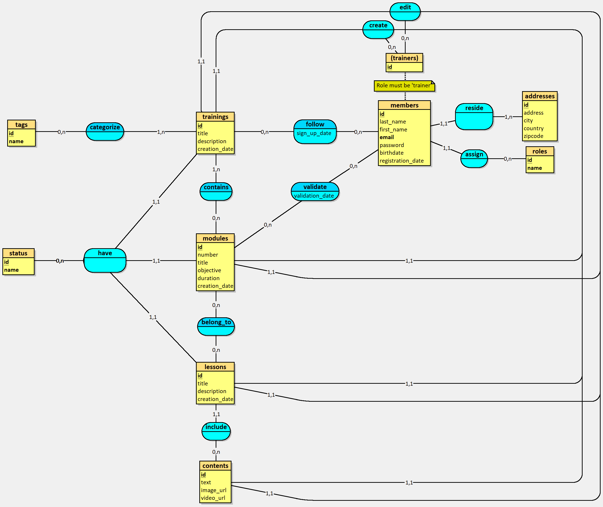

## Modèle Conceptuel des Données : MCD
Est une étape essentielle de la méthode Merise, réalisée en début de projet pour organiser et représenter clairement les données, sans considération technique, de manière compréhensible pour tous.

---

## Explication des cardinalités

### 1. Association "reside" entre **members** et **addresses**
- Un membre doit avoir exactement une adresse **(1,1)**, et une adresse peut être associée à un ou plusieurs membres **(1,n)**.

### 2. Association "assign" entre **members** et **roles**
- Un membre doit avoir exactement un rôle **(1,1)**, et un rôle peut être attribué à zéro ou plusieurs membres **(0,n)**.

### 3. Association "follow" entre **members** et **trainings**
- Un membre peut suivre zéro ou plusieurs formations **(0,n)**, et une formation peut être suivie par un ou plusieurs membres **(1,n)**.

### 4. Association "validate" entre **members** et **modules**
- Un membre peut valider zéro ou plusieurs modules **(0,n)**, et un module peut être valider par zéro ou plusieurs membres **(0,n)**.

### 4. Association "create" & "edit" entre **members et l'entité fictive trainers** et **trainings/modules/lessons/contents**
- Un membre est considéré comme formateur si son **rôle est égal à "trainer"** et peut créer et éditer zéro ou plusieurs formations, modules, leçons ou contenus **(0,n)**. Une formation, un module, une leçon ou un contenu est forcément rattaché à un formateur (qui devient donc un auteur) et peut être édité par un formateur **(1,1)**.

### 5. Association "categorize" entre **trainings** et **tags**
- Une formation peut être catégorisée avec un ou plusieurs tags **(1,n)**, et un tag peut être associé à zéro ou plusieurs formations **(0,n)**.

### 6. Association "contains" entre **trainings** et **modules**
-  Une formation peut contenir un ou plusieurs modules **(1,n)**, et un module peut être contenus dans zéro ou plusieurs formations **(0,n)**.

### 7. Association "belong_to" entre **modules** et **lessons**
- Un module peut appartenir à un zéro ou plusieurs leçons **(0,n)**, et une leçon peut appartenir à zéro ou plusieurs modules **(0,n)**.

### 8. Association "include" entre **lessons** et **contents**
- Une leçon peut inclure un ou plusieurs contenus **(1,n)**, et un contenu peut être inclus dans zéro ou plusieurs leçons **(0,n)**.

### 9. Association "have" entre **trainings/modules/lessons** et **status**
- Une formation, un module ou une leçon doit avoir exactement un statut **(1,1)**, et un statut peut être associé à zéro ou plusieurs formations, modules ou leçons **(0,n)**.