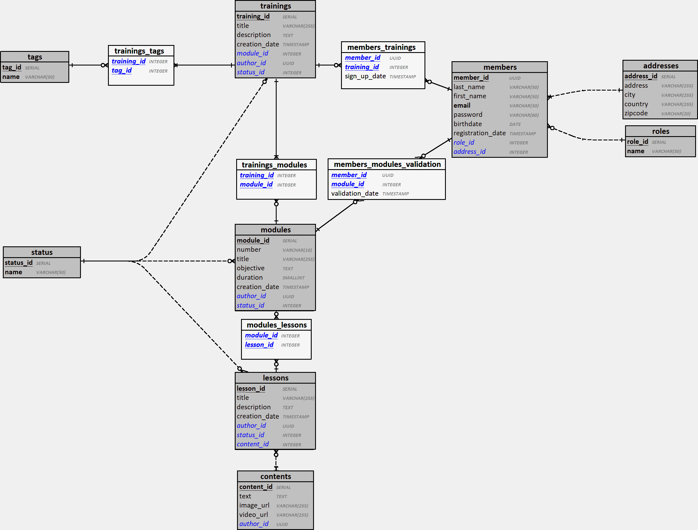

## Modèle Logique des Données : MLD
Réalisé après le MCD, il définit précisément les tables, les relations, les clés primaires et étrangères, et les types de données, tout en tenant compte des contraintes techniques pour une implémentation efficace.

