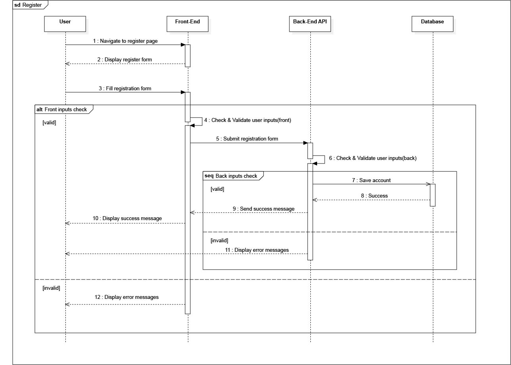

## Diagramme de séquence : Inscription

[< Retour à l'accueil](README.md)

Le diagramme de séquence représente les échanges entre les objets et les acteurs du système en fonction du temps. Pour un système complexe, plusieurs diagrammes de séquence sont nécessaires, chacun illustrant une sous-fonction (ex. : inscription, authentification), souvent en lien avec un cas d'utilisation.

