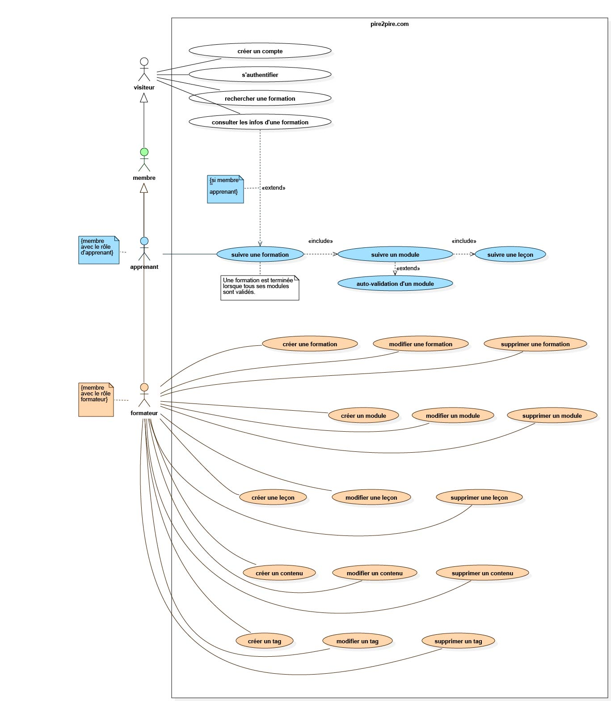

## Schéma Cas d'Utilisation : Use Case
En UML (langage de modélisation unifié), un diagramme de cas d'utilisation représente les interactions entre les utilisateurs (acteurs) et un système à l'aide de symboles spécifiques. Il détaille des scénarios précis, comme la connexion à une application, et clarifie les besoins fonctionnels. Cela permet de documenter et de visualiser les interactions, facilitant ainsi la collaboration entre les parties prenantes et l'équipe de développement.

